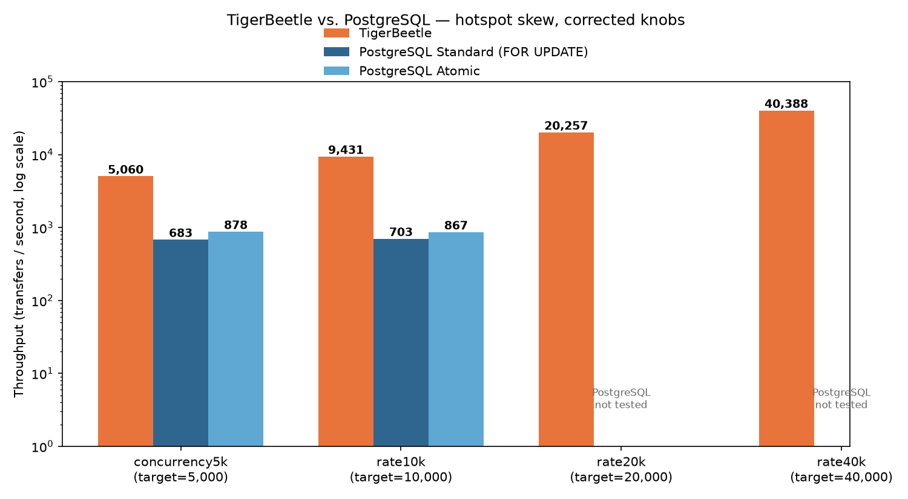
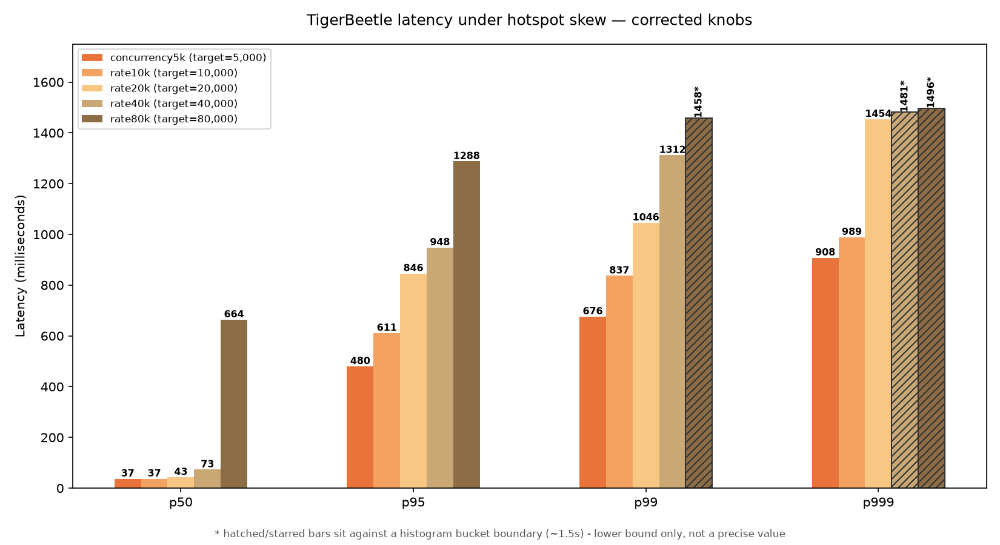

# TigerBeetle vs PostgreSQL Performance: Benchmark Harness, Cloud Tests

A few months ago, we tested the performance of TigerBeetle and PostgreSQL in
local benchmarks. The test replicated the typical workflow for TigerBeetle's
use case, that is, double-entry bookkeeping for creating transfers.

[We have seen](https://softwaremill.com/tigerbeetle-vs-postgresql-performance-benchmark-setup-local-tests/)
that in the local setup, TigerBeetle was almost 3 times faster than the
fastest PostgreSQL approach, but we still had the question of whether that's
also the case in more "real" scenarios. That's what we set out to find out
here - and along the way, we found and fixed a measurement problem in our own
harness that turned out to matter more than we expected. As usual, the
benchmark's code is [available on GitHub](https://github.com/softwaremill/tb-perf)
if you'd prefer to explore and run the tests yourself.

## Quick reminder: PostgreSQL schema

TigerBeetle has a fixed schema that supports only double-entry bookkeeping.
There are three main entities: ledgers, accounts, and transfers. A transfer
always involves two accounts: one is credited, while the other is debited.
As mentioned above, creating a transfer is the main database operation.
Here's a similar schema we use for this test in PostgreSQL:

```sql
CREATE TABLE IF NOT EXISTS accounts (
    id BIGINT PRIMARY KEY,
    balance BIGINT NOT NULL DEFAULT 0,
    CONSTRAINT balance_non_negative CHECK (balance >= 0)
);

CREATE TABLE IF NOT EXISTS transfers (
    id BIGSERIAL PRIMARY KEY,
    source_id BIGINT NOT NULL REFERENCES accounts(id),
    dest_id BIGINT NOT NULL REFERENCES accounts(id),
    amount BIGINT NOT NULL,
    created_at TIMESTAMPTZ NOT NULL DEFAULT NOW(),
    CONSTRAINT amount_positive CHECK (amount > 0),
    CONSTRAINT different_accounts CHECK (source_id != dest_id)
);

CREATE INDEX IF NOT EXISTS idx_transfers_source ON transfers(source_id);
CREATE INDEX IF NOT EXISTS idx_transfers_dest ON transfers(dest_id);
CREATE INDEX IF NOT EXISTS idx_transfers_created_at ON transfers(created_at);
```

## Three ways to write a transfer in PostgreSQL

Unlike TigerBeetle, PostgreSQL doesn't have one built-in way to record a
transfer, so we tested three implementation strategies, all doing the same
logical thing (debit one account, credit another, keep the total balance
constant) but with different concurrency-control approaches:

- **Standard (`SELECT ... FOR UPDATE`)** - the straightforward, textbook
  approach. Explicitly lock both account rows (in a consistent order, by
  account ID, to avoid a transaction deadlocking with itself) before
  reading and updating their balances. This is the safest and most common
  pattern for this kind of workload.
- **Atomic** - skip the explicit lock and instead issue a single
  `UPDATE accounts SET balance = balance - amount WHERE id = ? AND balance
  >= amount`, relying on PostgreSQL's own row-level MVCC locking rather
  than an application-level `SELECT ... FOR UPDATE`. One fewer round trip,
  slightly less lock overhead, same correctness guarantee.
- **Batched** - collect many pending transfers on the client side and
  submit them as a single array in one round trip over one shared database
  connection, explicitly designed to mirror TigerBeetle's own batching
  model. **This one didn't survive contact with a real multi-client cloud
  deployment**: with five independent client instances instead of one, two
  different connections' batches would deadlock with each other on the
  same hot rows, and PostgreSQL's deadlock detector would kill one side -
  we saw error rates up to 16.6% and throughput in the single digits.
  Since this is an architectural mismatch rather than something a config
  tweak fixes, we're not giving it the detailed treatment in this article;
  see our [local benchmark article](https://softwaremill.com/tigerbeetle-vs-postgresql-performance-benchmark-setup-local-tests/)
  if you want the full story.

The rest of this article focuses on standard and atomic, run side by side
with TigerBeetle.

## Methodology: what we're actually measuring

Before the results, it's worth being precise about what our two workload
knobs mean, because getting this wrong is exactly what led us to under-sell
TigerBeetle in an earlier round of this same test.

- **`target_rate`** is the *total* number of transfer requests per second
  the client fleet tries to issue, split evenly across however many client
  instances are running (5, in our setup - so `target_rate = 5000` means
  each client aims for 1,000 requests/sec). This is an *open-loop* load
  generator: it issues requests on a fixed schedule regardless of how fast
  the database is actually responding, which is a much closer match to how
  production traffic behaves (and to what an SLA usually promises) than
  "how fast can I possibly go if I let it."
- **`max_concurrency`** is a safety valve: the maximum number of requests
  each client is allowed to have in flight (sent but not yet completed) at
  once, also split evenly across clients. If a client is about to send a
  new request but is already at its concurrency limit, that request is
  **dropped** rather than queued - it never reaches the database at all.

That second knob is the one that bit us. In our first round of cloud
testing, we set `max_concurrency = 1,000` total (200 per client) without
tracking how many requests were actually being dropped by it. TigerBeetle's
real per-transfer latency is low enough (32ms median) that, by Little's Law,
its *tail* latency under load implied far more requests in flight than 200
per client could ever hold - meaning a meaningful fraction of load was being
silently discarded before it ever touched the database, and our
"TigerBeetle achieved only 4,461 TPS" number was measuring our own
concurrency cap, not TigerBeetle's actual capacity.

We fixed this by adding a `dropped_transfers` counter to our results export
(it existed on the client already, we just weren't collecting it), then
re-ran the hotspot-skew tests at progressively higher `max_concurrency` and
`target_rate` values to see how far TigerBeetle could actually go. The
results below use those corrected numbers.

## Performance benchmark in the cloud

Last time we ran locally, one database instance and one client. For more
real-world scenarios, we ran a cluster for each database and 5 client
instances. TigerBeetle recommends six nodes across three cloud providers;
we used three for this test, configured for its usual leader + 2 replicas
consensus. Likewise, we used a similar setup for PostgreSQL with one primary
and two synchronous standbys (quorum commit, so transactions are
acknowledged only after they're durable on primary and at least one
standby).

These benchmarks were performed on Google Cloud Platform. In addition to the
mentioned instances for clients and the database, we also have one node
running our monitoring stack with Prometheus and Grafana. For clients, we
used `n2-standard-2` (2 vCPU, 8 GB RAM) instances, and for the database, we
used `n2-highmem-4` (4 vCPU, 32 GB RAM) instances.

### Running and coordinating tests

The coordinator code is responsible for distributing the client's code,
starting the database, initializing accounts, and running the benchmark. We
are still using Docker to deploy the database, but we use
`--security-opt seccomp=unconfined` to enable `io_uring` since the host is
not shared. When it comes to client code, we don't want to bring a whole
Rust and Zig toolchain to build the binary on instances. We are using
`cargo zigbuild` to cross-compile the client's binary and copy it onto VM
instances.

## Test results

The test's duration is 5 minutes with a 2-minute warmup and 3 iterations. We
tested two account-contention regimes, characterized by the Zipfian
exponent, resulting in "hotspot" accounts:

- **Moderate skew** (Zipfian s = 1.0) - roughly evenly spread load, tested
  at `target_rate = 5,000` / `max_concurrency = 1,000` (we haven't re-run
  this regime with the corrected knobs yet - see "What's next" below).
- **Heavy hotspot skew** (Zipfian s = 2.0) - a small number of accounts
  absorb a disproportionate share of transfers, closer to what a real
  ledger looks like. This is the regime we re-tested with corrected knobs,
  and where the results below come from.

### Moderate skew (Zipfian s = 1.0) - as originally measured

| Metric | TigerBeetle | PostgreSQL Standard | PostgreSQL Atomic |
|---|---|---|---|
| Mean throughput | **4,097 TPS** | 2,890 TPS | 3,068 TPS |
| p50 latency | **32.3 ms** | 324.7 ms | 303.7 ms |
| p95 latency | **508 ms** | 581 ms | 556 ms |
| p99 latency | **748 ms** | 960 ms | 927 ms |
| Error rate | 0% | 0% | 0% |
| Balance verified | 3/3 | 3/3 | 3/3 |

### Heavy hotspot skew (Zipfian s = 2.0) - corrected knobs

This is where it gets interesting - and where the gap widens considerably
compared to our first pass at this test. We ran five variants, doubling the
offered load each time and raising `max_concurrency` generously alongside
it (it's a pure client-side safety valve with no corresponding server-side
resource limit, unlike PostgreSQL's connection pool, so there's no cost to
overprovisioning it):

| Variant | target_rate | max_concurrency |
|---|---|---|
| `concurrency5k` | 5,000 | 5,000 |
| `rate10k` | 10,000 | 5,000 |
| `rate20k` (TigerBeetle only) | 20,000 | 30,000 |
| `rate40k` (TigerBeetle only) | 40,000 | 100,000 |
| `rate80k` (TigerBeetle only) | 80,000 | 200,000 |

| Metric | TigerBeetle | PostgreSQL Standard | PostgreSQL Atomic |
|---|---|---|---|
| **`concurrency5k`** |
| Mean throughput | **5,060 TPS** | 683 TPS | 878 TPS |
| Dropped requests | **0** | 3.9M | 3.8M |
| **`rate10k`** |
| Mean throughput | **9,431 TPS** | 703 TPS | 867 TPS |
| Dropped requests | 598K (~9%) | 8.5M | 8.4M |
| **`rate20k`** |
| Mean throughput | **20,257 TPS** | not tested | not tested |
| Dropped requests | **0** | - | - |
| **`rate40k`** |
| Mean throughput | **40,388 TPS** | not tested | not tested |
| Dropped requests | **0** | - | - |
| **`rate80k`** |
| Mean throughput | **81,171 TPS** | not tested | not tested |
| Dropped requests | **0** | - | - |

Error rate stayed at 0% and balance verified 3/3 across every one of these
runs - the differences are entirely about performance, not correctness.
PostgreSQL wasn't re-tested past `rate10k` because that test already showed
its throughput doesn't move with `target_rate` (see "What we tried on
PostgreSQL's side" below) - we spent the later rounds pinning down
TigerBeetle's ceiling instead.



A note on latency, and a genuine measurement gap worth being upfront about:
at these corrected knob values, *every* PostgreSQL latency percentile (p50
through p999) hit the ceiling of our metrics export histogram, which we'd
bounded at 5 seconds. That means we know real PostgreSQL latency at this
load is **at least** 5 seconds at every percentile including the median,
but we don't have a precise number beyond "at least 5s." TigerBeetle's own
latency stayed real and informative for most of this sweep, but not all of
it - the same histogram also has a bucket boundary at exactly 1.5 seconds,
and at `rate40k` and especially `rate80k`, TigerBeetle's p99 and p999
started landing right against that boundary too (with near-zero run-to-run
variance, the signature of a value being capped by the measurement rather
than converging naturally). The chart below marks those bars with a hatch
pattern - treat them as "at least this much," not a precise reading. p50
and p95 never approach that boundary at any point in this sweep, so they're
fully trustworthy, and they're where the most interesting result of this
whole sweep shows up:



## Headline takeaways

- **TigerBeetle wins on every metric, and the gap is bigger than we
  originally reported.** At matched offered load (`concurrency5k`),
  TigerBeetle is now **5.8x** PostgreSQL's best mode (atomic) under hotspot
  skew - not the 4.6x we measured before fixing our own concurrency cap.
  Against PostgreSQL's best observed number across this entire
  investigation (878 TPS), TigerBeetle's `rate80k` result (81,171 TPS) is
  **~92x** higher, though that comparison isn't apples-to-apples since we
  didn't re-test PostgreSQL at that offered rate.
- **We found the first real ceiling signal - not in throughput, in
  latency.** We doubled the offered rate four times (5k -> 10k -> 20k ->
  40k -> 80k), and throughput kept tracking the offered rate almost
  exactly at every single step - `dropped_transfers` was zero at `rate20k`,
  `rate40k`, and `rate80k`. By that metric alone, TigerBeetle never showed
  a wall. But median (p50) latency told a different story on the last
  doubling: it exploded from 73ms to **664ms** - a 9x jump, dwarfing every
  previous doubling's growth (0%, +16%, +70%). p95 also jumped sharply
  (+36%, 948ms -> 1,288ms). Throughput holding steady while median latency
  grows 9x is a classic saturation signature: TigerBeetle is very likely
  queueing a large, growing backlog internally, and only keeps accepting
  the full offered rate because the generous `max_concurrency` gives it
  room to do so. This is the strongest signal in the whole investigation
  that we're at or very near TigerBeetle's real practical ceiling under
  this specific hotspot workload - even though the coordinator's own
  pass/fail thresholds (error rate, drops) never flagged anything wrong.
  We stopped the sweep here rather than push to 160,000: with median
  latency already at 664ms and the tail already capped by our own
  histogram, continuing would mostly measure how large a backlog the
  concurrency cap allows to build, not find a materially different answer.
- **The corrected numbers are more trustworthy, not just bigger.** Our
  original hotspot numbers for TigerBeetle were an artifact of an
  unmeasured concurrency cap, not TigerBeetle's real capacity. Once we
  tracked `dropped_transfers` and raised the cap, TigerBeetle's own ceiling
  turned out to be *much higher* than we'd been reporting.
- **PostgreSQL's ceiling under hotspot skew is architectural, not a tuning
  gap.** We tried raising `max_concurrency`, raising `target_rate`, and
  separately raising `connection_pool_size` (see below) - none of them
  moved PostgreSQL's throughput meaningfully. That's a stronger, more
  useful finding than "PostgreSQL is slower": it tells you tuning
  PostgreSQL's client-side knobs won't get you out of this regime; the
  bottleneck is row-lock contention on the hot accounts themselves.
- **Correctness held everywhere**, across every test in this article and
  the several rounds of testing that produced it. The differences are only
  in performance.

## What we tried on PostgreSQL's side

Once we'd found that TigerBeetle's original numbers were capped by our own
harness, we asked the obvious follow-up question: was something similar
throttling PostgreSQL? We tested raising `connection_pool_size` from 20 to
50 (the number of database connections each client instance keeps open) at
both `concurrency5k` and `rate10k`. The first attempt actually made things
*worse* - it turned out our test cluster's PostgreSQL `max_connections`
setting (200) was smaller than what 5 clients x 50 connections would need
(250), so connections were being outright refused rather than queued. We
raised `max_connections` to 300 to remove that as a confound, then re-ran:
throughput still didn't improve (642-796 TPS across both executors and
knob values, essentially flat versus the pool=20 numbers above). That's a
second, independent piece of evidence pointing at row-lock contention -
not connection availability, not the concurrency cap, not the offered rate
- as PostgreSQL's real constraint here.

## Summary

TigerBeetle seems to deliver on its promise in our benchmarks, and more
convincingly than our first pass at this cloud test suggested. We tried to
replicate a more realistic environment and workload to test both databases,
and along the way, tightened up our own measurement methodology enough to
find that we'd been under-reporting TigerBeetle's actual advantage by a
wide margin. The differences remain clear: TigerBeetle's lower latency,
higher throughput, and consistent behavior under contention, against a
PostgreSQL ceiling that several different tuning knobs all failed to move
- and against a TigerBeetle ceiling that took five rounds of progressively
higher load to even start to find.

### What's next

A few natural follow-ups we haven't run yet: re-testing moderate skew with
the corrected concurrency knobs (we'd expect a similar, if smaller, upward
correction for TigerBeetle there); widening the client's histogram bucket
boundaries past 1.5 seconds (`client/src/metrics.rs`) before doing any
further high-load TigerBeetle testing, since we're now flying blind on
tail latency exactly when it matters most; and testing `synchronous_commit`
levels for PostgreSQL, since each row lock is currently held for the
duration of a full cross-zone replication round trip - shrinking that hold
time is the one lever in this whole investigation that would directly
target the mechanism we now believe is the actual bottleneck. We're
deliberately not recommending another blind doubling to 160,000: with
median latency already at 664ms and the histogram already capped at the
tail, the next useful step is fixing the measurement, not pushing further
on top of a metric we can no longer trust past the 99th percentile.
